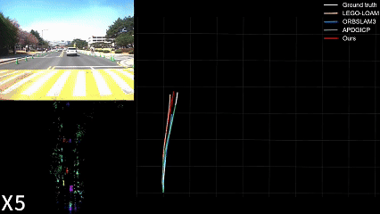

# EFEAR-4D：Ego-velocity Filtering for Efficient and Accurate 4D radar Odometry

[Paper (Arxiv)](https://arxiv.org/abs/2405.09780), [IEEEXplore](https://ieeexplore.ieee.org/document/10685149), [Video](https://www.youtube.com/watch?v=3Q6F9az0ACg)


<div style="text-align: center;">
  
</div>

## 1. Dependency
### 1.1 **Ubuntu** and **ROS**
Ubuntu 64-bit 18.04 or 20.04.
ROS Melodic or Noetic. [ROS Installation](http://wiki.ros.org/ROS/Installation):


### 1.2 **EFEAR-4D** requires the following libraries:
- Eigen3
- OpenMP
- PCL
- ceres

## 2. Install

Use the following commands to download and compile the package.

```
cd ~/catkin_ws/src
git clone https://github.com/CLASS-Lab/EFEAR-4D.git
cd ..
catkin_make
```
## 3. System architecture


- Develop an accurate ego-velocity estimation method using our enhanced physical model of radial Doppler velocity. We utilize DBSCAN clustering to eliminate dynamic object interference and noise, ensuring reliable performance even in challenging dynamic environments.

- Introduce a novel 4D radar odometry framework that combines Doppler velocity measurement with feature-based point-to-point (P2P) matching. Our solution effectively handles 4D radar point cloud sparsity while maintaining robust localization accuracy across diverse urban scenarios.

## 4. Run the package

1. Run the launch file:
```
roslaunch efear run.launch
```

2. Play existing bag files:
```
rosbag play your-bag.bag 
```

## 5. dataset
Download some sample datasets to test the functionality of the package. The datasets below are configured to run using the default settings:
- **MSC dataset**: [Google Drive](https://drive.google.com/drive/folders/1wCoiC4WzlgyLCSZMaYEdFcTqjOc0IkGQ)
- **NTU dataset**: [github](https://github.com/junzhang2016/NTU4DRadLM) 

## 6. Evaluate the results
In our paper, we use [evo](https://github.com/MichaelGrupp/evo.git), the performance indices used are RE (relative error) and ATE (absolute trajectory error).

## 7、Acknowlegement
1. EFEAR-4D is based on [dan11003 / CFEAR_Radarodometry](https://github.com/dan11003/CFEAR_Radarodometry) 
CFEAR Radar odometry 
2. [zhuge2333 / 4DRadarSLAM](https://github.com/zhuge2333/4DRadarSLAM.git) 4DRadarSLAM
3. [christopherdoer/reve](https://github.com/christopherdoer/reve) radar ego-velocity estimator
4. [TixiaoShan / LIO-SAM ](https://github.com/TixiaoShan/LIO-SAM) 

## 8、Paper

Thank you for citing EFEAR-4D if you use any of this code.
```
@ARTICLE{efear-4d,
  author={Wu, Xiaoyi and Chen, Yushuai and Li, Zhan and Hong, Ziyang and Hu, Liang},
  journal={IEEE Robotics and Automation Letters}, 
  title={EFEAR-4D: Ego-Velocity Filtering for Efficient and Accurate 4D Radar Odometry}, 
  year={2024},
  volume={9},
  number={11},
  pages={9828-9835},
  keywords={Radar;Doppler radar;Odometry;Doppler effect;Estimation;Point cloud compression;Feature extraction;SLAM;autonomous vehicle navigation;4D mmWave radar;radar odometry},
  doi={10.1109/LRA.2024.3466071}}
```
